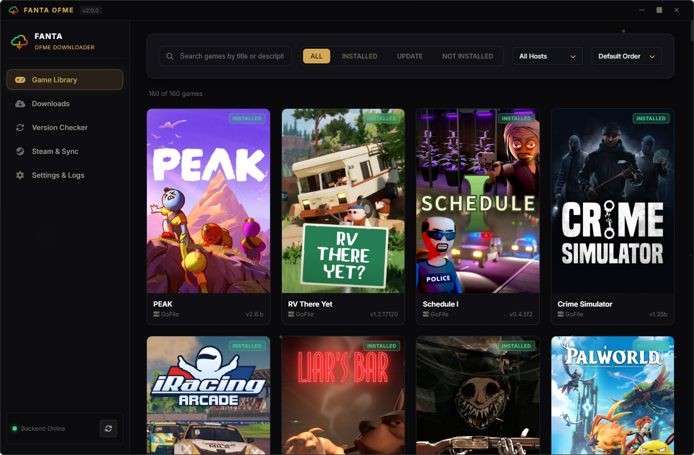
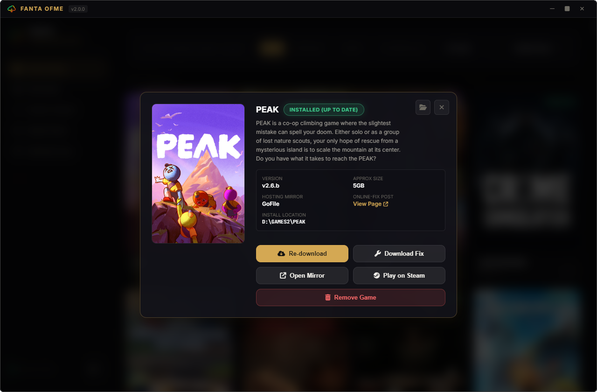
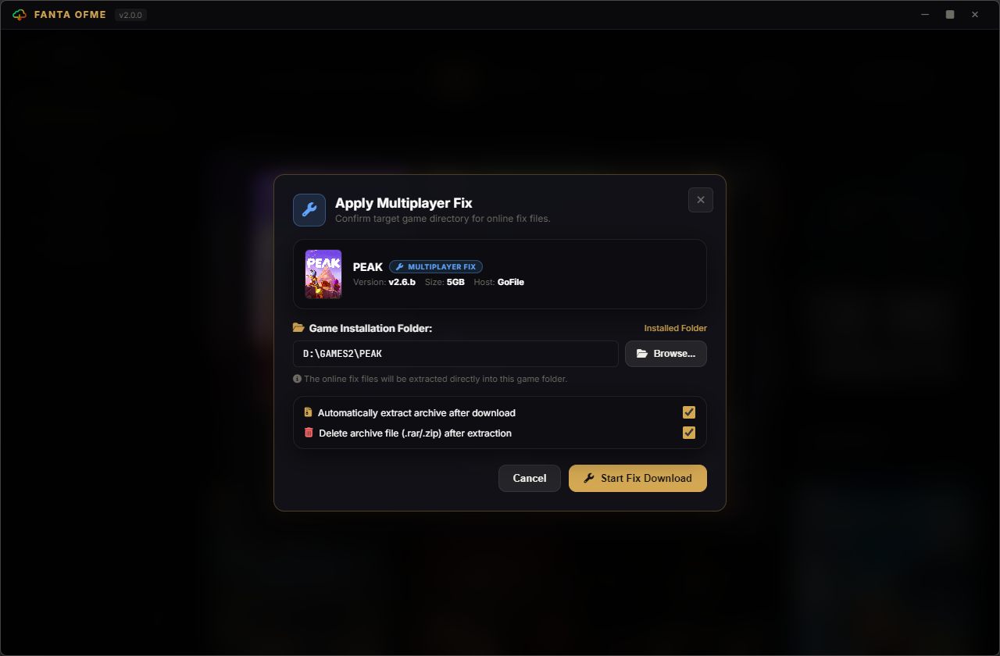
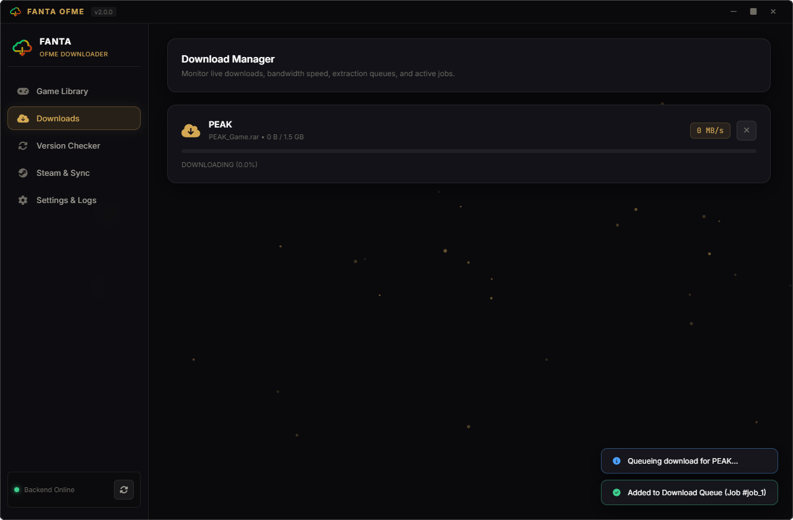
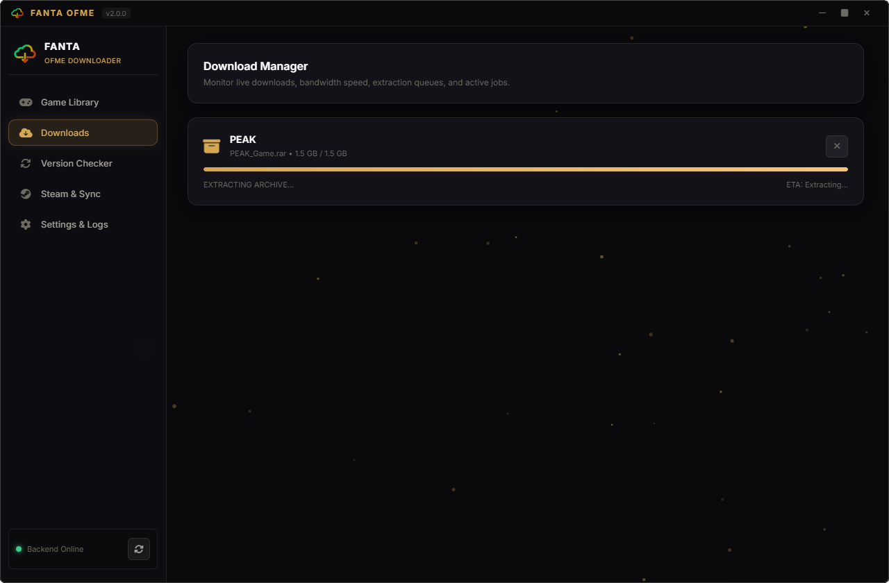
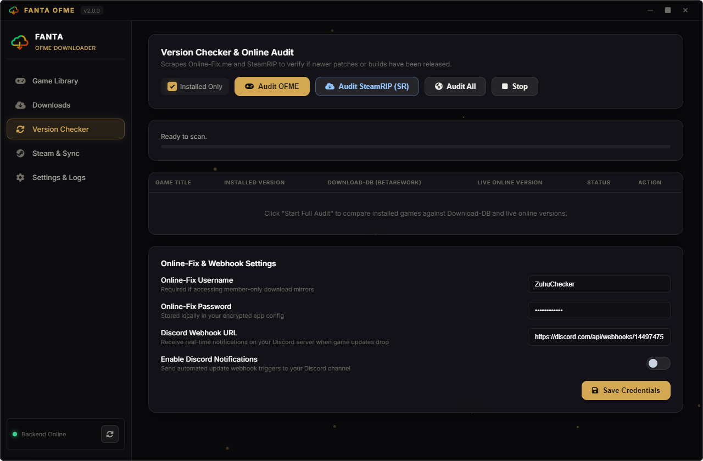
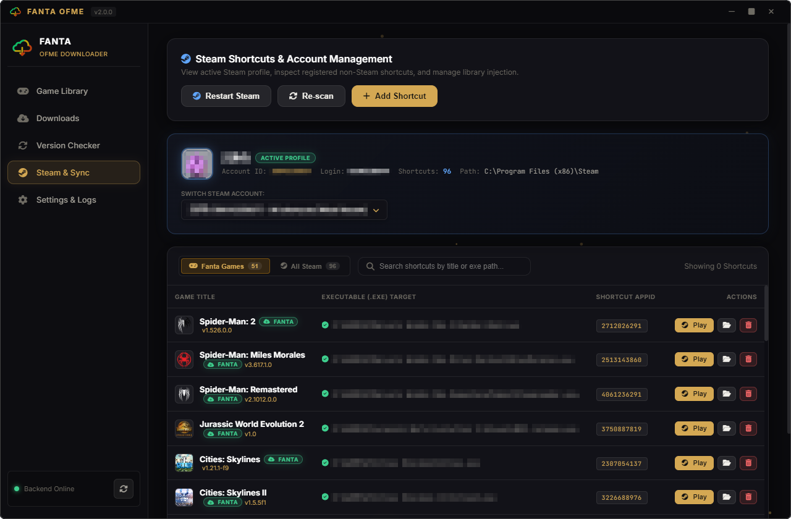
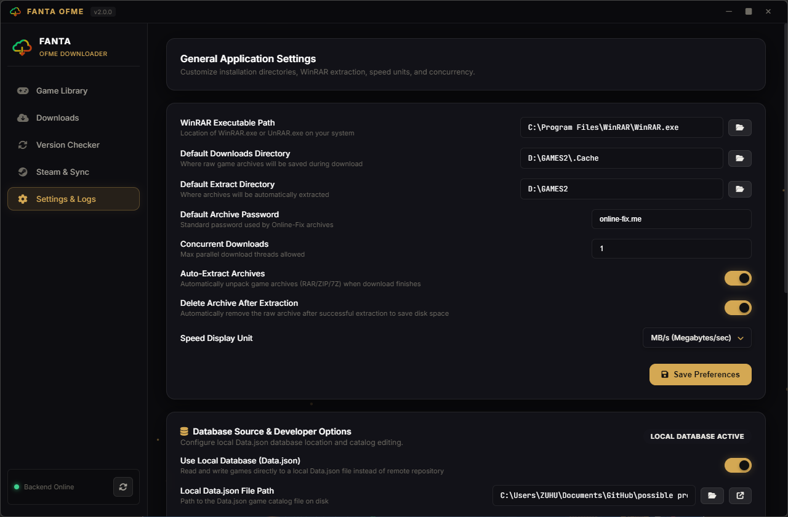

# FANTA OFME Downloader (v2.0.0)


A desktop game library manager and automated downloader for Online-Fix releases. **Fanta OFME Downloader** pairs a dark glassmorphism Electron interface with a modular Python backend to manage game downloads, automated WinRAR extractions, live version audits, and one-click Steam shortcut integration.

---

## Interface Preview

### Game Library


<details>
<summary><b>Click to view more screenshots (Modal, Downloads, Version Checker, Steam & Settings)</b></summary>

<br>

| Game Details Modal | Download & Installation Setup |
| :---: | :---: |
|  |  |

| Multiplayer Fix Setup | Live Download Queue |
| :---: | :---: |
|  |  |

| Automated Extraction | Online-Fix Version Checker |
| :---: | :---: |
|  |  |

| Steam & Account Sync | Settings & Live Console |
| :---: | :---: |
|  |  |

</details>

---

## Features

- **Interactive Game Library**: Browse and search catalog titles with instant filtering, host tags, and installed/update status pills.
- **Multi-Threaded Download Manager**: Resume-capable downloads with live download speeds, percentage tracking, and host resolution (GoFile, PixelDrain, Mega, etc.).
- **Automated Archive Extraction**: Automatic password-protected extraction (`online-fix.me`) via WinRAR with optional post-extract archive cleanup.
- **Online-Fix.me Version Checker**: Live scraping and audit scanner to check your installed games against latest releases.
- **Steam Shortcut Integration**: Automatically detect local Steam accounts and add games as Non-Steam shortcuts with one click.
- **Safe Uninstaller**: 3-tier uninstall options (Delete Files + Unregister, Unregister Only, or Cancel) with strict root-path deletion protection.
- **Built-in Auto Updater**: Seamless in-place updates via GitHub Releases with notification prompt and 1-click silent background install.

---

## Getting Started

> [!TIP]
> ### Recommended: Download the Executable (.exe)
> This is the easiest way for most users and **does not require a Node.js or Python installation.**
>
> 1. Go to the [**Releases Page**](https://github.com/ZuhuInc/Simple-OFME-Downloader-LIB/releases).
> 2. Choose your preferred build from **Assets**:
>    - **Setup Installer (`Fanta OFME Downloader Setup 2.0.0.exe`)**: Recommended for automated background update support.
>    - **Standalone Portable (`Fanta OFME Downloader Portable 2.0.0.exe`)**: Self-contained single-executable build without installation.
> 3. **Important:** Ensure [**WinRAR**](https://www.win-rar.com/) is installed for automated archive unpacking.
> 4. Launch the app and start downloading!
>
> [**Go to the Releases Page to Download**](https://github.com/ZuhuInc/Simple-OFME-Downloader-LIB/releases)

---

## For Developers & Technical Documentation

<details>
<summary><b>Click here for technical architecture, build instructions, and running from source</b></summary>

<br>

### Architecture Overview

The application is structured as a dual-runtime desktop app:
1. **Frontend (Electron Process)**: Handles window lifecycle, native dialogs, auto-updater (`electron-updater`), and modern glassmorphism GUI.
2. **Backend Bridge (Python Process)**: A modular Flask + Flask-SocketIO service managing downloads, multi-host link scrapers (GoFile, PixelDrain, Mega, etc.), WinRAR extraction child processes, and Steam VDF manipulation.
3. **IPC / Networking**: Real-time bidirectional WebSocket & REST bridge running on `localhost:5004`.

```
├── src/
│   ├── main/                 # Electron main process, IPC handlers & Auto-updater
│   │   ├── main.js
│   │   └── preload.js
│   ├── renderer/             # Frontend UI (HTML5, Vanilla CSS3 & JS)
│   │   ├── index.html        # Single-page interface
│   │   ├── app.js            # Frontend router & orchestrator
│   │   ├── styles/           # Glassmorphism design system & animations
│   │   ├── assets/           # Application icons & game posters
│   │   └── js/controllers/   # Modular UI subsystem controllers
│   └── backend/              # Python service layer
│       ├── bridge_server.py  # Flask + Socket.IO server entry point
│       ├── config.py         # Settings & dynamic Data.json manager
│       ├── database.py       # Catalog cache & local database handler
│       ├── downloader.py     # Threaded download engine & speed tracker
│       ├── extractor.py      # WinRAR automation wrapper
│       ├── steam.py          # Steam VDF shortcuts parser & injector
│       ├── version_checker.py# Online-fix.me release scraper
│       └── controllers/      # Flask Blueprints (games, downloads, steam, etc.)
├── scripts/
│   ├── build.js              # Complete build orchestrator (PyInstaller + Electron Builder)
│   └── build_backend.py      # PyInstaller backend freezing utility
├── Assets/
│   └── Menu2/                # Interface preview screenshots
└── package.json              # Electron & electron-builder packaging configuration
```

---

### Prerequisites

* **Node.js**: v18.0.0 or higher
* **Python**: 3.10 or higher
* **WinRAR**: Installed on system
* **Chrome / Brave / Edge**: Used by Selenium/Curl for GoFile token resolution

---

### Running from Source

#### 1. Clone the repository
```bash
git clone https://github.com/ZuhuInc/Simple-OFME-Downloader-LIB.git
cd Simple-OFME-Downloader-LIB
```

#### 2. Install Node Dependencies
```bash
npm install
```

#### 3. Setup Python Virtual Environment (`.venv`)

**Windows (PowerShell):**
```powershell
python -m venv .venv
.\.venv\Scripts\activate
pip install -r src/backend/requirements.txt
```

**macOS / Linux:**
```bash
python3 -m venv .venv
source .venv/bin/activate
pip install -r src/backend/requirements.txt
```

> **Note:** Electron automatically discovers and uses `./.venv` when launching the backend bridge in development mode.

#### 4. Launch Development Environment
```bash
npm run dev
```

---

### Building & Packaging Executables

The build pipeline uses `scripts/build.js` to freeze the Python backend into a standalone binary using PyInstaller and packages Electron using `electron-builder`:

```bash
# Build both Portable .exe (in build/File/) and Setup Installer (in build/Installer/)
npm run build:all

# Build only the Standalone Portable .exe and unpacked test directory
npm run build:file

# Build only the NSIS Setup Installer with auto-updater metadata
npm run build:installer

# Freeze only the Python backend
npm run build:backend
```

#### Build Output Directories:
- `build/File/`: Contains `Fanta OFME Downloader Portable 2.0.0.exe` and `win-unpacked/`.
- `build/Installer/`: Contains `Fanta OFME Downloader Setup 2.0.0.exe`, `latest.yml`, and blockmap.

---

### Running Unit Tests

Backend test suites can be executed via:
```bash
python -m unittest discover -s src/backend/tests
```

</details>

---

## License & Credits

This project is licensed under the **MIT Non-Commercial License (MIT-NC)** - see the [LICENSE](LICENSE) file for details. You are free to use, modify, and distribute this software for personal and non-commercial purposes. Commercial use or selling of this software is strictly prohibited.

Developed by **ZuhuInc**. All rights reserved. Game titles and assets are property of their respective creators.
